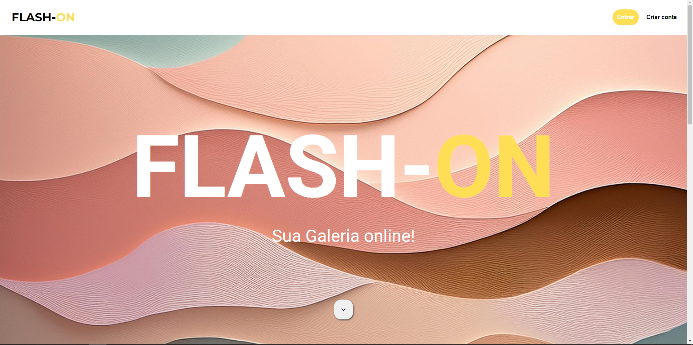
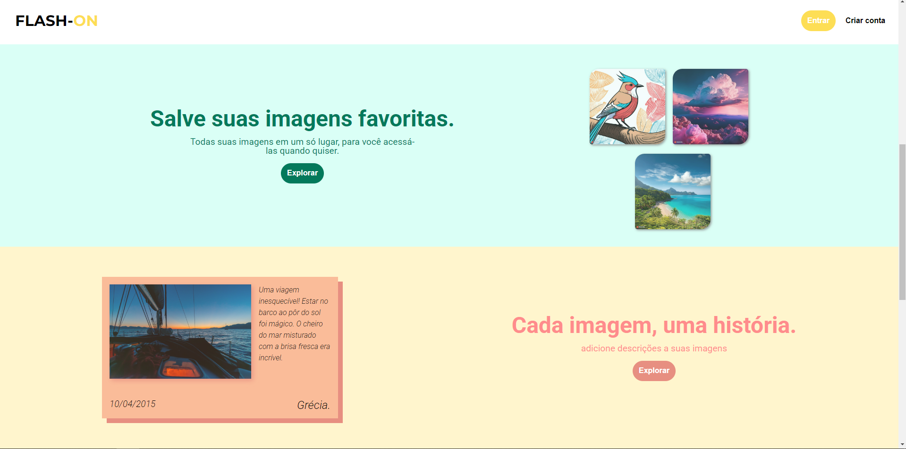
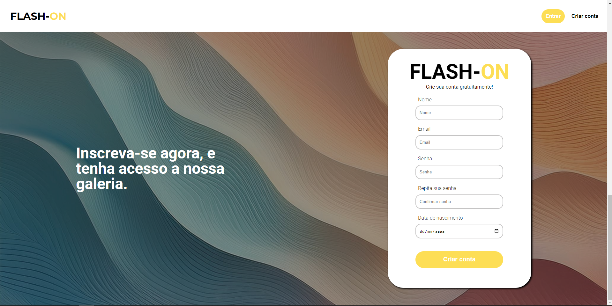
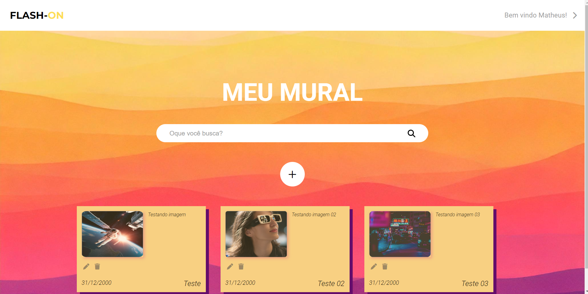
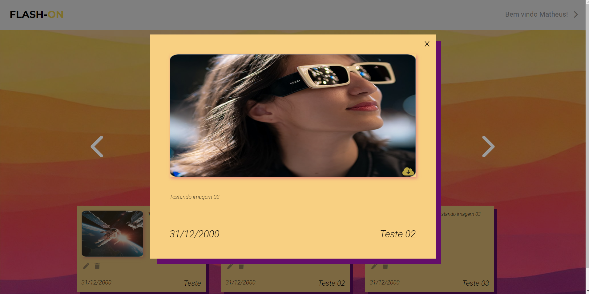
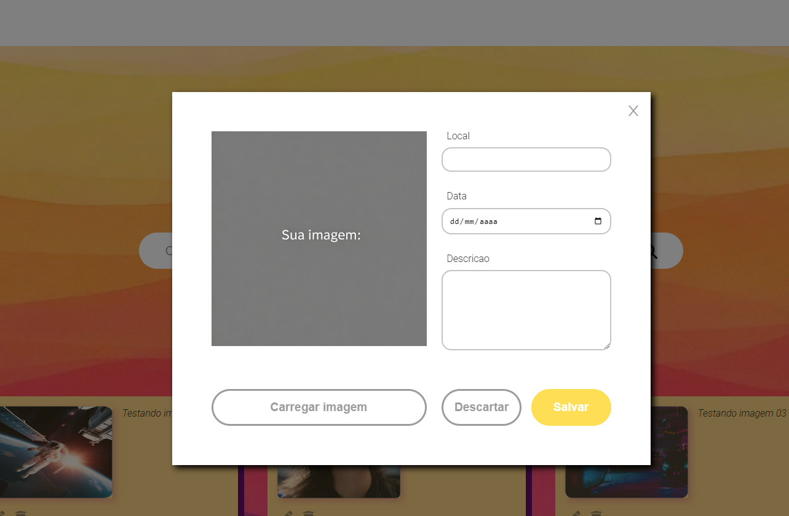

# 🖼️ Galeria Online com Login e Gerenciamento de Imagens

Um sistema de galeria de imagens com login e cadastro, onde é possível fazer upload de imagens, buscar, visualizar em tela cheia, baixar, editar e excluir imagens. Desenvolvido com HTML, CSS, JavaScript, Vite, Axios e JSON Server.

---

## Funcionalidades

- Login e cadastro de usuários  
- Upload de imagens com título, data e descrição  
- Visualização em grande escala  
- Download da imagem  
- Busca por imagens  
- Edição e exclusão de imagens  

---

## Tecnologias usadas

- HTML5  
- CSS3  
- JavaScript (Vanilla JS)  
- Vite  
- Axios  
- JSON Server  

---

## Como usar

1. Clone o repositório e abra a pasta no VS Code.  
2. Instale as dependências com o comando:

```bash
npm install
```

3. Suba o backend com JSON Server:

```bash
npm run json
```

> Isso iniciará o backend em `http://localhost:5500/`

4. Rode o frontend com Vite:

```bash
npm run dev
```

> Isso abrirá o projeto no navegador, geralmente em `http://localhost:5173/`

---

## Uso do sistema

- Faça login ou cadastre uma conta na tela inicial.  
- Para criar um novo card, clique no botão `+` no centro da tela e preencha os campos.  
- Para editar ou excluir um card, clique nos ícones de **lápis** ou **lixeira** no próprio card.  
- Para visualizar a imagem em tamanho completo, clique no card desejado.  
- Para baixar a imagem, clique no ícone de **nuvem com seta** no canto inferior da tela de visualização.

---

##  Perfil de teste

Você pode acessar o sistema rapidamente usando o seguinte perfil de teste:

- **Nome:** Teste01  
- **Email:** teste@teste.com  
- **Senha:** teste0001

## Demonstração visual

  
  





---

## Contribuição

Contribuições são bem-vindas! Sinta-se à vontade para abrir issues ou enviar pull requests.

---

## Contato

Matheus Campos – [LinkedIn](https://www.linkedin.com/in/matheus-cfs-rocha) – m.campos612003@gmail.com

---

## Licença

Este projeto está sob a licença MIT. Veja o arquivo LICENSE para mais detalhes.
